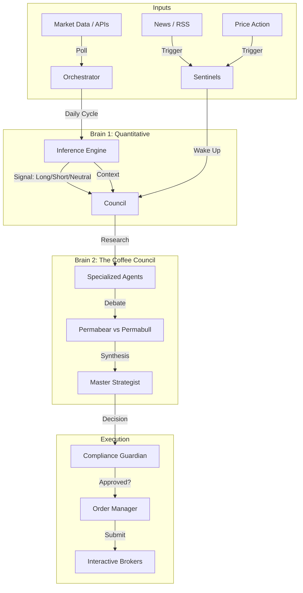

# ☕ The Automated Coffee Trading System

An event-driven, multi-agent AI trading system for Coffee Futures Options (KC). This platform combines quantitative machine learning models with a **"Coffee Council"** of specialized AI agents to analyze market microstructure, agronomy, supply chains, and macroeconomics in real-time.

---

## 🏗️ System Architecture

The system operates on a "Two-Brain" architecture:
1.  **Quantitative Brain**: An ensemble of LSTM and XGBoost models processing 60-day windows of price, spread, and economic data.
2.  **Qualitative Brain (The Council)**: A debate-driven multi-agent system that performs grounded research, challenges assumptions, and synthesizes a final trading decision.



---

## 🧠 The Coffee Council (Core AI Engine)

At the heart of the system lies **The Coffee Council**, a heterogeneous multi-agent system designed to mimic a professional commodities trading desk. Unlike standard "chat" bots, these agents have distinct personas, specific mandates, and a rigorous decision-making process.

### 👥 The Personas
The Council is composed of specialized agents, each powered by Large Language Models (Gemini, OpenAI, Anthropic) routed based on task complexity:

*   **👨‍🌾 The Agronomist**: Monitors weather patterns in Minas Gerais, flowering reports, and crop disease (Rust/Broca).
*   **🌍 The Macro Analyst**: Analyzes BRL/USD exchange rates, interest rates (Selic/Fed), and global inflation data.
*   **🚢 The Supply Chain Analyst**: Tracks shipping container indices, port congestion (Santos/Rotterdam), and export flow reports (Cecafé).
*   **📊 The Technical Analyst**: Studies chart patterns, RSI divergence, and moving averages on the futures curve.
*   **📉 The Volatility Analyst**: Examines IV Rank, skew, and option pricing to determine cheap/expensive premiums.
*   **🐻 The Permabear & 🐂 The Permabull**: Two adversarial agents whose sole job is to attack or defend the investment thesis.
*   **⚖️ The Master Strategist**: The final decision maker. It reviews all reports, watches the debate, and renders a verdict (Bullish/Bearish/Neutral) with a confidence score.

### 🔄 The Reflexion Loop
To prevent hallucinations, critical agents (like the Agronomist) utilize a **Reflexion Loop**.
1.  **Draft**: The agent generates an initial analysis based on gathered data.
2.  **Critique**: The agent (or a supervisor model) challenges its own findings: *"Did I cite a specific date? Is this source stale?"*
3.  **Revise**: The final output is rewritten to be strictly evidence-based.

### ⚔️ The Dialectical Debate
Before any trade is placed, a **Hegelian Dialectic** process occurs:
1.  **Thesis**: The specialized agents provide their reports.
2.  **Antithesis**: The **Permabear** attacks the reports, looking for flaws. The **Permabull** defends the thesis with evidence.
3.  **Synthesis**: The **Master Strategist** weighs the arguments. If the debate reveals significant risks, the confidence score is lowered, potentially vetoing the trade.

---

## 📡 The Sentinel Array

The system is not just time-based; it is **Event-Driven**. A sophisticated array of "Sentinels" runs continuously to monitor the world for specific trigger events.

*   **Price Sentinel**: Watches for sudden >2% moves or microstructure breakdowns.
*   **News Sentinel**: Scrapes RSS feeds and APIs for keywords like "Frost", "Strike", or "Regulation".
*   **Weather Sentinel**: Monitors real-time forecasts for critical growing regions.
*   **Microstructure Sentinel**: Analyzes order book imbalances and liquidity gaps.

When a Sentinel triggers, it initiates an **Emergency Council Session**, bypassing the standard schedule to react immediately to breaking news.

---

## ⚙️ Quantitative Foundation

While the AI Agents provide the reasoning, the **Quantitative Engine** provides the anchor.
*   **Models**: An ensemble of **LSTM (Long Short-Term Memory)** networks for sequence analysis and **XGBoost** for tabular feature importance.
*   **Features**: 60-day rolling windows of price, volatility (GARCH), term structure (Spreads), and macro indicators.
*   **Function**: The ML model provides a "Base Signal" (e.g., *Long with 65% confidence*). The Council then treats this as just another input—they can agree with it, or override it if qualitative factors (like a port strike) aren't in the numerical data yet.

---

## 🛡️ Execution & Risk Management

A trade decision is only as good as its execution.

### Compliance Guardian
The **Compliance Guardian** acts as the system's "Constitution". Before any order is submitted, it checks:
*   **Liquidity**: Is the spread too wide?
*   **Exposure**: Do we already have too much risk in this expiration?
*   **Sanity**: Is the target price realistic?
*   **"Fat Finger" Check**: Prevents erroneous large orders.

### Dynamic Order Manager
The **Order Manager** handles the lifecycle of the trade:
*   **Adaptive Sizing**: Position sizes are calculated dynamically based on account equity and signal confidence (Kelly Criterion logic).
*   **Combo Orders**: Executes complex multi-leg strategies (Spreads, Condors) as atomic "BAG" orders on IBKR to ensure no legging risk.
*   **Stale Position Closer**: Automatically manages inventory, closing positions that have hit time or profit targets.

---

## 🚀 Technical Setup

### Prerequisites
*   Python 3.10+
*   Interactive Brokers TWS/Gateway (running and accepting API connections)
*   API Keys for: Google Gemini, OpenAI, Fred, Pushover (Notifications)

### Configuration
The system is controlled via `config.json`. Key sections include:
*   `"model_registry"`: Define which LLM powers which agent (e.g., `gemini-1.5-pro` for Master, `gemini-flash` for Sentinels).
*   `"risk_management"`: Set hard limits on drawdowns and position sizes.
*   `"sentinels"`: Configure polling intervals and sensitivity thresholds.

### Running the System
1.  **Start the Orchestrator**:
    ```bash
    python orchestrator.py
    ```
    This launches the scheduler and the background event loop.

2.  **View the Dashboard**:
    ```bash
    streamlit run dashboard.py
    ```
    Provides a real-time view of active agents, debate transcripts, and portfolio performance.

---
*Built for the Coffee Futures Market (KC).*
