# Real Options — Algorithmic Commodity Futures Trading

An event-driven, multi-agent AI trading system for commodity futures options. Uses a Council of specialized AI analysts with adversarial debate to generate trading decisions, managed by a constitutional compliance framework.

## Architecture: The Federated Cognitive Lattice

```mermaid
graph TD
    subgraph "Tier 1: Always-On Sentinels"
        XS[🐦 X Sentiment]
        WS[🌤️ Weather]
        NS[📰 News/RSS]
        PS[📊 Microstructure]
    end

    subgraph "Tier 2: Specialist Analysts"
        AG[🌱 Agronomist]
        MA[💹 Macro Economist]
        FU[📈 Fundamentalist]
        TE[📐 Technical]
        VO[📊 Volatility]
        GE[🌍 Geopolitical]
        SE[🐦 Sentiment]
    end

    subgraph "Tier 3: Decision Council"
        PB[🐻 Permabear]
        PL[🐂 Permabull]
        DA[😈 Devil's Advocate]
        MS[👑 Master Strategist]
    end

    XS & WS & NS & PS -->|Emergency Trigger| AG & MA & FU & TE & VO & GE & SE
    AG & MA & FU & TE & VO & GE & SE -->|Reports| PB & PL
    PB & PL -->|Debate| MS
    MS -->|Decision| DA
    DA -->|Approved| EX[⚡ Order Execution]
    DA -->|Vetoed| BLOCK[🛑 Trade Blocked]
    EX --> IB[Interactive Brokers Gateway]
```

### How It Works

1. **Sentinels** monitor the world 24/7 (weather, news, social sentiment, market microstructure)
2. When a sentinel detects a significant event, it triggers an **Emergency Council Session**
3. **Specialist Agents** research using grounded data (Google Search, RSS, API data)
4. **Permabear attacks** the thesis; **Permabull defends** — Hegelian dialectic debate
5. **Master Strategist** weighs evidence using weighted voting and renders a verdict
6. **Devil's Advocate** runs pre-mortem analysis to catch blind spots
7. **Compliance Guardian** validates position sizing, VaR limits, and margin requirements
8. Approved trades execute via **Interactive Brokers** as options spreads

### Key Design Principles

- **Heterogeneous LLM Routing** — Different AI providers (Gemini, OpenAI, Anthropic, xAI) for different roles, preventing algorithmic monoculture
- **Constitutional AI Compliance** — Compliance has veto power over all trades
- **Commodity-Agnostic** — Profile-driven configuration supports any ICE/CME futures contract
- **Event-Driven** — Sentinels trigger analysis on-demand vs. fixed schedules
- **Fail-Safe** — All components fail closed (block trades on error)

## Trading Strategies

| Market Condition | Strategy | Signal Type |
|-----------------|----------|-------------|
| Bullish directional | Bull Call Spread | DIRECTIONAL |
| Bearish directional | Bear Put Spread | DIRECTIONAL |
| High volatility expected | Long Straddle | VOLATILITY |
| Low volatility / range-bound | Iron Condor | VOLATILITY |

## Data Files

| File | Purpose |
|------|---------|
| `decision_signals.csv` | Lightweight decision log (10 columns, one row per contract per cycle) |
| `data/council_history.csv` | Full forensic record (30+ columns, agent reports, debate text) |
| `trade_ledger.csv` | Executed trades with fill prices and P&L |
| `data/agent_accuracy_structured.csv` | Brier scoring for agent prediction accuracy |

## Dashboard

Streamlit-based Real Options with pages:

1. **🦅 Cockpit** — Live operations, system health, emergency controls
2. **⚖️ Scorecard** — Decision quality analysis, win rates
3. **🧠 Council** — Agent explainability, consensus visualization
4. **📈 Financials** — ROI, equity curve, strategy performance
5. **🔧 Utilities** — Log collection, manual overrides
6. **🎯 Signal Overlay** — Decision forensics against price action

## Tech Stack

- **Execution:** Interactive Brokers Gateway (ib_insync)
- **AI:** Google Gemini (research), OpenAI/Anthropic/xAI (analysis), heterogeneous routing
- **Memory:** ChromaDB (Transactive Memory System for cross-agent knowledge)
- **Dashboard:** Streamlit
- **Hosting:** Digital Ocean Droplets

## License

Proprietary. All rights reserved.
